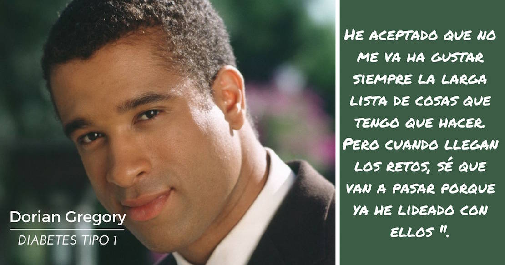

Descubre sobre celebridades con diabetes tipo 1, el tipo de diabetes que, en mi opinión, considero más complicada. La diabetes tipo 1 es una condición donde el cuerpo no produce insulina que es la hormona que convierte la glucosa en energía. 

## 12 Celebridades con Diabetes Tipo 1

La diabetes tipo 1 afecta a alrededor de 3 millones de personas en los Estados Unidos solamente, y todas las personas con diabetes tipo 1 - incluyendo celebridades - deben reemplazar su insulina todos los días. Así, cada vez que tome las medidas necesarias para controlar tu enfermedad, no veas tan feo a esa inyectadora, recuerda que tú podrías ser una celebridad muy famosa.

## 1\. Mary Tyler Moore
c

Ahora de 70 años, la actriz Mary Tyler Moore siempre ha utilizado su fama para ayudar a recaudar fondos y crear conciencia para la diabetes. Mejor conocida por sus papeles en The Mary Tyler Moore Show y The Dick Van Dyke Show, se le diagnosticó a los 33 años con diabetes tipo 1. Desde entonces, se ha convertido en la presidenta internacional de the Juvenile Diabetes Research Foundation.. A principios de 2009, Moore publicó un nuevo libro titulado Growing Up Again, que comparte la historia de su vida lidiando con la diabetes, enfermedad que padece, y que **casi hace que pierda la vista y una pierna**.

## 2\. Crystal Bowersox

La finalista American Idol,  Crystal Bowersox casi tuvo que abandonar la competición de 2010, cuando presentó [cetoacidosis](http://dediabetes.com/que-es-la-cetoacidosis-diabetica/) diabética (CAD), una condición grave que puede conducir al coma o la muerte. LA CAD le ocurrió de pronto - muy rápidamente sus niveles de pH bajaron tan dráticamente que de acuerdo a los resultados de su prueba, debería haber caído en estado en [coma diabetico](/signos-de-un-coma-diabetico). Pero cuando el productor ejecutivo Ken Warwick le dijo que ella estaba fuera de la serie, ella no aceptó. _"Yo, literalmente, rogué, supliqué, y lloré y le dije: 'De ninguna manera he llegado tan lejos para dejar que la diabetes me detenga!"_ fueron sus palabras a Warwick.

Diagnosticada a los 6 años, Bowersox está usando su nueva fama para hablar acerca de la conciencia de la diabetes: Ella es una defensora de the Juvenile Diabetes Research Foundation (JDRF), que apoya todas las medidas para encontrar mejores tratamientos y una cura para la diabetes tipo 1.

## 3\. Jean Smart

La actriz Jean Smart tuvo su gran oportunidad cuando obtuvo un papel en la exitosa serie de televisión _Designing Women_. Desde entonces, ha participado en películas, obras de teatro y programas de televisión, incluyendo _the thriller 24_. No sólo es inteligente y tiene una exitosa carrera como actríz, también se ha dedicado a sí misma como una mentora, recaudadora de fondos, y activista en la lucha contra la diabetes tipo 1. Apenas tenía 13 años cuando le diagnosticaron diabetes tipo 1.

## 4\. Elliott Yamin

Elliott Yamin puede ser que sea mejor conocido por su voz para cantar, lo que le ganó el tercer lugar en American Idol quinta temporada, pero también está haciendo noticia como un defensor de las personas con diabetes. Yamin fue diagnosticado a los 16 años, después de que su madre (que tiene [diabetes tipo 2](http://dediabetes.com/diabetes-tipo-2/)) reconoció sus síntomas: letargo, sed extrema, y dolores en las articulaciones como signos de alarma de nivel alto de azúcar en la sangre.

Pero Yamin no siempre fue tan tranquilo con su diagnóstico. "Me puse muy rebelde. No quería tomar mi insulina y me negaba a creer que en realidad tenía diabetes", fueron sus palabras a Diabetes Health en 2008. "Yo estaba enojado. Pensé que el futuro era sombrío y que no sería capaz de hacer las cosas que siempre quise hacer" Tal vez lo más  digno de Yamin fuesu capacidad para superar estos temores: Él nunca dejó que su condición se interpusiera en el camino de su sueños estelares. De hecho, él ha hablado con franqueza a sus fans acerca de la diabetes, e incluso  fue franco y abierto a este respecto con los jueces de American Idol durante su primera actuación.

## 5\. Dorian Gregory

La diabetes corre en la familia del actor Dorian Gregory, el anfitrión del programa de larga duración TV Soul Train. El actor, que también ha aparecido en series como Charmed y Baywatch Nights, fue diagnosticado con diabetes tipo 1 a los 9 años. Dio este consejo en dLife, una plataforma de comunicaciones que aborda los problemas de la diabetes: "Hay que hacer que el mantenimiento de la diabetes adaptarse a su construcción . Si eres olvidadizo, debes establecer alarmas para recordarte lo que tienes que hacer. Debes saber que la vida es nuestra medicina, no sólo las inyecciones o píldoras que tomamos. El ejercicio, la alimentación, el sueño, la gestión del estrés es también nuestra medicina. Toma todo tu medicamento, y estarás bien ".

## 6\. Bret Michaels

Bret Michaels, nacido en 1.963, es  conocido como estrella del reality VH1 (Rock of Love) y como vocalista de la banda de rock Poison. Michaels fue diagnosticado con diabetes tipo 1 a los 6 años, pero no fue pública su condición hasta poco después del lanzamiento del primer álbum de Poison cuando concedió una entrevista en EE.UU. Hoy en día, dio este consejo sobre cómo vivir con la diabetes: "Aceptar que tienes la enfermedad. Sigue tomando tu [insulina](http://dediabetes.com/que-es-la-insulina-cuantos-tipos-existen/). Mantenla bajo control. Además, disfruta de tu vida. Me he mantenido en buena forma física por tener la mente, la materia y la música sobre la enfermedad".

## 7\. Anne Rice

La autora Anne Rice aprendió por las malas que tenía diabetes tipo 1. Era 1998, y Rice, conocida por sus novelas _Vampire Chronicles_, se despertó con un dolor de cabeza y problemas de respiración. _Fue sólo después de que ella entró en coma que se hizo el diagnóstico de la diabetes_. En estos días, Rice tiene la enfermedad bajo control y anima a otros a no ignorar los síntomas. "Si usted piensa que tiene alguna posibilidad de que podría tener diabetes, por amor de Dios, vaya a hacerse la prueba de azúcar en la sangre", dijo a ABC News. "Es una prueba sencilla."

## 8\. Damon Dash

Damon Dash saltó a la fama como el ex director general y co-fundador de Roc-A-Fella Records con Shawn "Jay-Z" Carter y Kareem "Biggs" Burke. Aunque Dash es un nombre muy conocido en el mundo de la música, la moda y el cine, había mantenido la mayoría de su diagnóstico de diabetes tipo 1 en secreto. "No sé si alguien sabe que soy diabético. Creo que es importante que la gente sepa que está bien ser diabético y saber cómo cuidar de ella", dijo a CNN.

## 9\. Sonia Sotomayor

La Juez Asociada en la Corte Suprema de los Estados Unidos, Sonia Sotomayor tenía 8 años de edad cuando fue diagnosticada con diabetes tipo 1. En el momento de su nominación a la Corte Suprema en mayo de 2009, algunos cuestionaron si la condición de Sotomayor afectaría su capacidad para servir. Pero en su ascenso desde la infancia ella luchó y fue a estudiar en Princeton y Yale, hasta que se sentó en el máximo tribunal de USA, y se ha negado a permitir que la diabetes le robe sus oportunidades. Como Sotomayor señaló en un discurso después de su nominación: "Soy una persona común y corriente que ha sido bendecida con extraordinarias oportunidades y experiencias."

## 10\. Casey Johnson

No todas las celebridades con diabetes han superado sus obstáculos. Por desgracia. El 4 de enero de 2010, a los 30 años de edad, Casey Johnson - heredera de la fortuna Johnson & Johnson - fue encontrada muerta en su casa. Médicos forenses informaron que su muerte estaba relacionada con la diabetes y probablemente debido a u_n ataque de [cetoacidosis](http://dediabetes.com/que-es-la-cetoacidosis-diabetica/)_; Johnson tenía antecedentes de un inadecuado control sobre su diabetes, debiendo ir al hospital por lo menos dos veces por olvidar tomar su insulina.

La socialité no siempre había sido negligente con su enfermedad. En 1994 co-escribió un libro titulado "Managing Your Child's Diabetes (Control de la diabetes de su hijo)" con su padre Robert "Woody" Johnson, quien desarrolló una pasión para el tratamiento de la enfermedad. Woody todavía sirve como presidente de _the Juvenile Diabetes Research Foundation_, que rinde homenaje a su difunta hija y la lucha por una cura.

## 11\. Gary Hall Jr.

El nadador olimpico Gary Hall Jr. demostró a los médicos (y a sí mismo) de lo que era capaz, un año después de que él fue diagnosticado con diabetes tipo 1 y se pensó que nunca más volvería a ser capaz de competir a nivel olímpico. Eso fue en el 2.000. Ese año, se llevó a casa su primera medalla de oro individual a través de la carrera 50 metros estilo libre, una hazaña que repitió en 2004.

Hall está intensamente involucrado en esfuerzos para curar la enfermedad que casi redujo su carrera: su epónimo llamado _Foundation for Diabetes_ apoya la investigación enfocada en la cura, y él sirve como un portavoz del the Diabetes Research Institute \[DRI\]. "La diabetes no tiene que interponerse entre usted y sus sueños, y es por eso que todos estamos aquí", dijo Hall en una reunión para la recaudación de fondos en beneficio del DRI.

## 12. Halle Berry

La actriz galardonada con el premio de la Academia, Halle Berry, es conocida por sus papeles en películas como Monster's Ball, X-Men y Die Another Day. Lo que no es muy conocido es que tiene diabetes.

En 1989, la actriz de 42 años de edad, entró en un coma diabético durante la grabación de la serie de televisión Living Dolls, y más tarde fue diagnosticada con diabetes tipo 1. Desde entonces, Berry ha hablado abiertamente sobre el control de la diabetes.

## 13\. Nick Jonas

 

Nick Jonas, cantante del grupo americano Jonas Brothers, tiene diabetes tipo 1 y siendo prácticamente un adolecente ya podrás imaginarte como lo tomó. Sin embargo, él dice que el apoyo de su familia y de su banda fue fundamental para enfrentar ese nuevo reto en su vida, reto que siendo tan joven y famoso pudo haber generado consecuencias malas a nivel anímico, pero demostró que tiene pasta de luchador y aprendió a controlar su mal.

## 14\. Sharon Stone

La sexi simbol de lo 90 Sharon Stone se mantiene muy bien a sus 57 años (hasta posó desnuda últimamente) a pesar de que tiene diabetes tipo 1 (¿será por eso que Michael Douglas la encontraba tan dulce). Estuvo en coma intermitente a causa de un aneurisma cerebral (recuerda que la diabetes incrementa el riesgo de enfermedades coronarias y derramen cerebral) pero hoy en día está en control de su problema de salud y esta situación le enseñó a cuidarse más y ser una mujer más fuerte. Hace mucho ejercicio físico y es muy disciplinada con un nuevo estilo de vida saludable.

## 15. Doug Burns

Este era un pequeñín flaquito que le diagnosticaron diabetes tipo 1 a los 7 años. además sufría de asma. Era un total debilucho y acomplejado que más de una vez tuvo que ser llevado de emergencia en una ambulancia a un hospital por un ataque de [hipoglucemia](/la-hipoglucemia-nivel-bajo-de-azucar-en-sangre) mientras estaba en la escuela.

Aunque tenía amigos no podía compartir con ellos como le gustaría hacerlo, como alguien “normal”. Le tocó tiempos donde la diabetes no era tan comprendida por la comunidad médica como ahora. Pero un día, en quinto grado, vió una imagen de Samsón en una biblia que leía. La imagen era de un hombre musculoso que luchaba contra un león, el hombre de la imagen se veía felíz y Doug dijo que quería ser así.

## 16\. Adam Morrison

Nacido el 19 de julio de 1.984, este jugador de baloncesto, que llegó a jugar en la NBA con Charlotte Bobcats (2006-2009) y Los Angeles Lakers (2009-2010). Su padre era entrenador de basket y lo alentó desde pequeño a practicar dicho deporte. Cuando cursaba octavo el joven Morrison llegó a perder 14 Kg y se sentía muy débil, decía que no podía hacer nada. Luego de esto le diagnosticaron diabetes tipo 1. El muchacho lo tomó con positivismo y, con disciplina y tratamiento logró concretar su sueño de jugar en la NBA.
