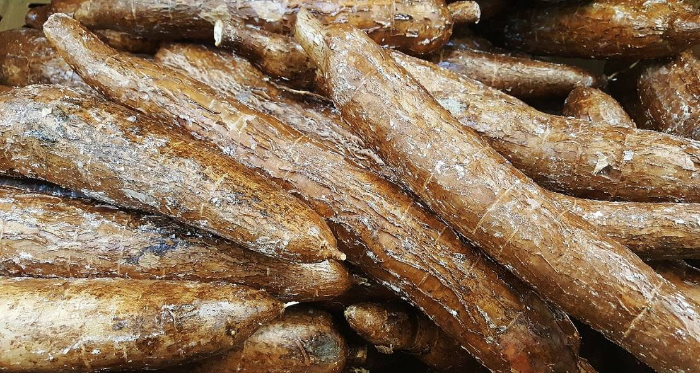

La yuca (Manihot esculenta), conocida también con el nombre de mandioca es una raíz conocida y es una importante fuente de alimento en muchos países de África, América Latina y en algunos países asiáticos.

La yuca es un alimento que se ha asociado a países en desarrollo y a situaciones de hambruna, debido a que se favorece su producción cuando no se puede cosechar otro tipo de tubérculos o cereales. Algunas de las razones por lo cual su producción aumenta en las condiciones antes mencionadas, es por su tolerancia a la sequía y a la infertilidad del suelo o suelos muy pobres.

Además, el tiempo de cosecha de la yuca es más flexible, mientras la mayoría de los otros cultivos se tienen un período específico, porque si la cosecha se retrasa, generalmente los productos se deterioran o caen al suelo y germinan o se pudren. La yuca, por su parte, puede permanecer en el campo hasta cuando se necesite y continúa creciendo.

## Propiedades Nutricionales de la Yuca

Entre las propiedades nutricionales de la yuca, se sabe que la composición de la raíz es principalmente de carbohidratos (80 % aproximadamente), por lo cual la hace un alimento de [fuente de energía](/como-recargarte-de-energia/), contribuyendo a cubrir las necesidades energéticas de los individuos. El aporte de proteínas es escaso, apenas 2-3 %.

En cuanto a grasas, igualmente su aporte es prácticamente nulo. El contenido de fibra de la yuca es moderado (2,40 g/100 g de alimento). El aporte de fibra puede tenerse a consideración debido a la tendencia que hay entre los consumidores a incluir productos integrales por los beneficios que proporciona a la salud.

Según varios estudios la yuca contiene una cantidad significativa de hierro, fósforo, calcio y es relativamente rica en vitamina C. También aporta cantidades moderadas de vitaminas del complejo B, como por ejemplo: Tiamina (B1), Riboflavina (B2), Niacina (B3), Folato y Ácido Pantoténico. Sin embargo, luego de la cocción o procesamiento cierta cantidad de estas vitaminas se pierden.

## Compuestos bioactivos de la yuca

Existen algunas investigaciones que apuntan a que las raíces de origen tropical, entre ellas la mandioca, poseen ciertos compuestos bioactivos, es decir, compuestos con capacidad de promover un efecto benéfico al organismo y mejorar o preservar el estado de salud.

Alguno de estos compuestos pareciera tener un efecto antioxidante similar al de la vitamina E (α–tocoferol), sin embargo, faltan más estudios que avalen esta hipótesis ya que la información, que se encuentra actualmente documentada es muy escasa para indicar una recomendación terapéutica con estos alimentos.

## Hojas de planta de la yuca

Últimamente se ha venido evaluando la utilización de las hojas de la yuca como alimento alternativo para el consumo humano, debido a su alto valor nutritivo. Por mucho tiempo las hojas de la yuca se ha empleado en la preparación de alimento para el consumo animal, sin embargo, en África y otros países es usada por las personas para su consumo en tiempos de crisis.

A nivel nutricional, las hojas tienen alto contenido de proteínas, vitamina A, C, del complejo B, hierro, calcio, zinc y fósforo. Por lo cual lo hace un producto que pudiera ser utilizado principalmente por los sectores de la población económicamente más deprimidos, debido a su bajo costo.

Es importante que las hojas sean debidamente tratadas previo a su consumo para evitar el efecto tóxico. En este sentido hay dos formas principales de preparación:

- **Estrujar y secar al sol:** Se deben estrujar las hojas y colocarlas al sol para secarlas hasta que se obtenga un polvo, en este momento ya es seguro su consumo. El polvo puede ser añadido a las sopas, atoles, ensalada, etc., para elevar el valor nutricional de las comidas.
- **Hervir la hoja en agua con vinagre:** Se pueden colocar a hervir las hojas en agua con una pequeña cantidad de vinagre, Cuando estén tiernas, se retiran del fuego, se pasan por un colador y se les retira las nervaduras. En esta forma de preparación pueden ser usadas en ensaladas, omelet, guisos de carne o pollo, etc. es muy parecida a los usos que se le da a la espinaca o acelga.
- Otro punto importante a mencionar es que, si se mezcla la harina de la hoja de yuca o la hoja hervida con la raíz de yuca o la harina de la yuca, se pueden obtener suplementos alimenticios con alto valor nutricional, debido a la complementación del aporte energético proveniente de la raíz y el aporte de proteínas y vitaminas de la hoja.

## Beneficios para la Salud

- Es fuente de energía, ya que el nutriente en mayor proporción son los carbohidratos.
- La fibra que contiene, podría favorecer al control de colesterol en sangre, de triglicéridos y de la glicemia. Para un adecuado manejo de la glicemia se debe consumir la yuca en su justa medida.
- Al cocinarse y enfriarse, el almidón se convierte en almidón resistente, éste sumado a la fibra que contiene genera un efecto saciante, disminuyendo la ansiedad.
- Ayuda a mejorar la sintomatología del [colon irritable](/como-limpiar-el-colon/), a través de su contenido de fibra.
- También contiene potasio, el cual regula la frecuencia cardíaca y la presión arterial.
- [No contiene gluten](/guia-completa-alimentos-sin-gluten/), por lo cual puede ser perfectamente utilizada en personas con celiaquía, autismo u otro tipo de intolerancia al gluten.
- Al no tener componentes alérgenos puede incorporarse a la dieta del niño a partir de los 7 meses de vida.
- Es un alimento fácilmente digerible.

## Productos derivados de la mandioca

Con la raíz de mandioca se pueden obtener varios productos para la preparación de comidas. A parte de la raíz hervida, para el consumo humano, se pueden realizar:

- **Harina de yuca**: Es el derivado de la yuca más común. Se prepara cortando la raíz en trozos pequeños, luego se colocan a secar al sol para posteriormente molerlos hasta formar la harina. Con este producto se puede preparar [tortas](/tortas-para-diabeticos/), panquecas, muffins, pan, [galletas](/recetas-caseras-de-galletas-para-los-diabeticos/), masa para pizzas, entre otros.
- **Farinha**: Es la harina que se obtiene de la yuca amarga. El procesamiento elimina los compuestos tóxicos de este tipo de yuca. El procesamiento consiste en rallar la yuca y colocarla en una especie de prensa para extraer el líquido, luego la masa húmeda que queda en la prensa se coloca en bandejas grandes y se tuesta, removiéndola hasta que seque. De aquí se retira la harina y queda lista para ser utilizada en las preparaciones.
- **El gari**: Es un producto similar a la farinha, pero su procesamiento incluye la fermentación. En esta ocasión luego de rallada la yuca, se colocan en bolsas y se exprimen, poniendo sobre estas piedras o trozos de madera. Posteriormente se deja en la bolsa por varios días para que fermente. Pasado los días, la masa se tuesta o se fríe, por lo general con aceite de palma, hasta que seca.
- **Casabe**: Es conocido también como cassava, en inglés. Es un producto típico de Venezuela. Su proceso es similar a la farinha, sólo que cuando se exprime, la masa o pulpa, se amasa y se extiende hasta formar una torta muy plana la cual se cocina en una plancha hasta obtener un producto parecido a una tortilla.
- **Mañoco**: Es un producto fabricado principalmente por los pueblos indígenas de la amazonia de Venezuela. Básicamente es el casabe hecho harina. Este producto se le puede agregar a la sopa o guisos, aumentando el valor nutritivo de las preparaciones.

## Raciones de consumo

La yuca tiene un índice glucémico (IG) alto, es decir, que tiene la capacidad de aumentar en gran medida sus niveles de glicemia (azúcar en sangre), por tal motivo, las personas con Diabetes deben moderar su consumo.

Se aconseja consumir 1 taza de yuca, si es el único carbohidrato de la comida, si por el contrario va a incluir, a parte de la yuca, pan, tortilla, arroz, frijoles, etc., la ración debe ser de ½ taza.

Para lograr un mejor control de su glicemia y contrarrestar el efecto de la yuca en su glicemia, es deseable, que incluya en sus comidas vegetales y frutas enteras o en trozos. Si va a tomar jugo en su comida puede agregarle 1 ó 2 cucharaditas de linaza molida.

## Riesgo del Consumo de la Yuca Amarga

Si bien la yuca proporciona múltiples beneficios a la salud, se debe tener precaución al momento de comprar este tubérculo, ya que existe una variedad conocida como yuca amarga, la cual contiene niveles tóxicos de compuesto cianógeno. En general, tanto la yuca dulce como la yuca amarga contienen cierta cantidad de estos compuestos, no obstante, en la yuca dulce los niveles acumulados de cianuro son menores y fácilmente se elimina con la cocción.

La yuca cruda contiene linamarina, la cuál por acción de una encima (linamarasa) se convierte en ácido cianhídrico (cianuro), un compuesto venenoso. A pesar de que ocasionalmente se han registrado muertes por la ingestión de yuca cruda[^1], los métodos tradicionales de cocción reducen los niveles de cianuro, haciéndola segura (la yuca dulce) para el consumo humano y animal.

Como se mencionó la causa de la intoxicación es el ácido cianhídrico, conocido también como cianuro de hidrógeno, el cual produce inhibición de numerosos sistemas del organismo, ataca a las células nerviosas y afecta las funciones del pulmón y riñón.

A continuación, le indicamos algunas características a tener en consideración para que pueda diferenciar entre la yuca dulce y la yuca amarga:

<table className="border min-w-full bg-white text-lg">
  <thead className="bg-gray-800 text-white uppercase">
    <tr>
      <th title="Field #1">Yuca dulce</th>
      <th title="Field #2">Yuca amarga</th>
    </tr>
  </thead>
  <tbody>
    <tr>
      <td>Tiene corteza delgada o fina</td>
      <td>La corteza en más gruesa</td>
    </tr>
    <tr className="bg-gray-200">
      <td>La pulpa es totalmente blanca</td>
      <td>La pulpa tiene una ligera tonalidad rosada</td>
    </tr>
    <tr>
      <td>
        Al tomar una pequeña porción cruda de la pulpa y probarla, el sabor es
        neutro
      </td>
      <td>
        Si se toma una pequeña porción cruda de la pulpa y se prueba, esta sabe
        amarga
      </td>
    </tr>
    <tr className="bg-gray-200">
      <td>La corteza se desprende fácilmente al pelarla</td>
      <td>La corteza no se desprende fácilmente</td>
    </tr>
    <tr>
      <td>
        Se ablanda rápidamente tras la cocción. Entre 10-20 min para ablandar
      </td>
      <td>
        Tarda mucho en ablandarse o no se ablanda. Entre 45-60 min apara
        ablandar
      </td>
    </tr>
    <tr className="bg-gray-200">
      <td>
        Al cocinarla, la pulpa tiene un color uniforme, el cual puede ser blanco
        o ligeramente amarillento,
      </td>
      <td>
        Al cocinarla, la pulpa no tiene un color uniforme, en el centro es
        amarillenta y los bordes blancos, bien diferenciados.{' '}
      </td>
    </tr>
  </tbody>
</table>

Se recomienda comprar este tubérculo en locales de confianza tipo supermercados, de esta manera se puede evitar la confusión. Igualmente, en caso de sospecha otra alternativa es hervirla y cambiarle el agua, mínimo cuatro veces. De esta forma los compuestos precursores del cianuro van a ser eliminados de la yuca a través del agua desechada.

Los síntomas que pueden presentar las personas que ingirieron yuca amarga son: - Dolor abdominal y nauseas (aparecen 3 horas aprox. posterior a su ingestión) - Vómitos - Dolor de cabeza - Perturbaciones neurológicas - Temblores en el cuerpo

Si ha consumido yuca sospechosa y presenta alguno de estos síntomas debe acudir rápidamente a su centro de salud, para asistencia y tratamiento médico.

[^1]: [Qué Es La Yuca Amarga Que Vinculan Con Varias Muertes En Venezuela Y Por Qué Es Tan Peligrosa](http://www.bbc.com/mundo/noticias-america-latina-39213495) - BBC Mundo. N.p., 2017. Web. 27 Apr. 2017.
