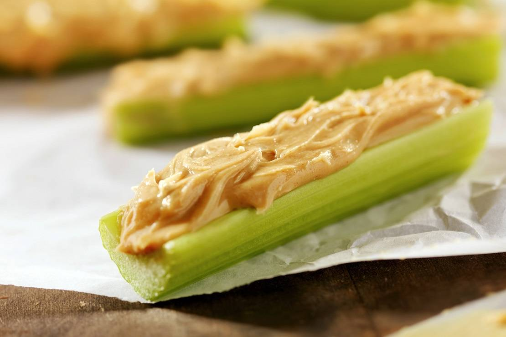

import Alert from '@material-ui/lab/Alert';

import { Link } from "gatsby";

El tratamiento dietético en los pacientes con diabetes es clave en el control de esta patología. Las guías internacionales establecen la importancia de las meriendas para diabeticos y recomiendan para el mejor control metabólico de la glicemia (azúcar en sangre) realizar tres (03) comidas principales y entre dos (02) a tres (03) meriendas al día.

Si bien pude existir el mito entre los pacientes que comer varias veces puede mantener los niveles de glicemia elevados, la realidad es que al realizar meriendas a media mañana y a media tarde existe un mejor control de la glicemia, y en aquellos pacientes insulinodependientes se hace necesaria a fin de evitar [hipoglicemias](/la-hipoglucemia-nivel-bajo-de-azucar-en-sangre/). El hábito de merendar es tan importante en las personas con Diabetes Mellitus tipo 1 como en las que padecen de Diabetes Mellitus tipo 2.

Las meriendas pueden contribuir a reducir el hambre y a ofrecer un poco de [energía durante el día](/como-recargarte-de-energia/). Pero eso significa que hay que escoger los alimentos con cuidado. Se puede pensar que las meriendas están constituidas por alimentos con mucha cantidad de azúcares simples y grasas, pero la realidad es que existen muchas opciones saludables y deliciosas. La merienda ofrece una buena oportunidad para consumir una porción de cereales integrales, frutas, vegetales o frutos secos. Estos alimentos también hacen que se sienta satisfecho y disminuya los niveles de ansiedad.

Es importante tener en cuenta que, independientemente de la cantidad de meriendas que tenga su plan de alimentación, el tamaño de las porciones es la clave para mantener los valores de glicemia postpandrial dentro de los valores esperados.

<Alert variant="outlined" severity="info">
  Una buena alimentación tiene que ser parte de una serie de <Link to="/como-controlar-la-diabetes">pasos para controlar la diabetes</Link>
</Alert>

## ¿En qué momento puedo hacer meriendas?

Con el fin de proporcionar energía, evitar picos de glicemia, mejorar el metabolismo de la glucosa y disminuir la ansiedad por comida, hay dos momentos en el día propicios para hacer sus meriendas. La primera se puede realizar entre desayuno y almuerzo (1-2 hrs después del desayuno), la segunda, es vespertina, entre el almuerzo y la cena (2-3 hrs después del almuerzo); si se amerita se puede consumir una merienda nocturna, sobre todo si se coloca insulina en la noche, para evitar hipoglicemias nocturnas.

Si realiza ejercicio, también es importante que realice una merienda antes para prevenir la hipoglucemia.

Se ha descrito que el consumo de bebidas alcohólicas, especialmente con el estómago vacío, puede aumentar el riesgo a hipoglicemias, para evitarlo, es aconsejable que al consumir algún tipo de bebida espirituosa se haga en conjunto con una merienda. Hay que recordar que el consumo en exceso de bebidas alcohólicas es peligroso en aquellas personas que se administran insulina o medicamentos que estimulan la producción de la misma, tipo metformina.

Si va a realizar un viaje largo en avión o carretera, es aconsejable cargar a la mano una merienda para evitar hipoglicemias.

A continuación una lista con opciones de merienda que pueden ser ampliamente utilizadas por los pacientes con diabetes:

### Meriendas para diabeticos con menos de 5 gramos de carbohidratos

- 5 palitos de zanahorias
- 12 unidades de almendras o maní (cacahuate) o nueces o avellana o merey o pistacho
- 3 palitos de apio españa o célery + 1 cucharada de mantequilla de maní o cacahuate
- 1 taza de rodajas de pepino + 1 cucharada de mostaza
- 1 tz de cotufas de coliflor
- ¼ taza de arándanos frescos
- 1 taza de gelatina sin azúcar
- 1 rebanada de queso o pechuga (charcutería) de pavo o pollo
- 8 aceitunas verdes o negras
- 2 cucharadas de semillas de calabaza o sésamo

### Meriendas para diabeticos con 10-20 gramos de carbohidratos

- 3 tazas de palomitas de maíz (cotufas) de bajas calorías
- 1/3 de taza de pasta de garbanzos (hummus) + 1 taza de vegetales frescos cortados (zanahorias, brócoli, pepino, coliflor, apio españa o célery, o una combinación de estos)
- 1 taza de fruta fresca en trozos
- 1 quesadilla de queso (hecha con 1 tortilla integral + 30 g de queso cortado en trozos pequeños)
- 120 g de compota casera sin azúcar añadida
- 2 galletas de arroz + 1 cucharada de mantequilla de maní
- 1 paquete de galletas saladas tipo Kracker
- ½ sándwich de pavo (1 rebanada de pan integral + 30 gramos de pavo + mostaza)
- 1 rebanada de pan tostado + 1 cucharada de mermelada light

### Meriendas para diabeticos de 30 gramos de carbohidratos (buena opción para antes de hacer ejercicios)

- ½ sándwich de mantequilla de maní (1 rebanada de pan integral + 1 cucharada de mantequilla de maní ) + 1 taza de leche
- 200 cc de yogur de bajo en calorías + ¾ taza de fruta fresca en trozos
- ¾ taza de cereal integral + ½ taza de leche descremada
- 1 banana mediana + 1 cucharada de mantequilla de maní

## Consejos útiles para seleccionar una Meriendas para Diabeticos

- Para medir las raciones de alimento puede hacer uso de unidades de ayuda como, tazas y cucharas para medir.
- No se olvide contar los carbohidratos en su plan de alimentación si usted cuenta con el modo de contar carbohidratos.
- Evite comer meriendas mientras este en frente del televisor o una computadora o mientras lea o maneje.
- Almacene opciones de meriendas para diabeticos saludables para que siempre las tenga disponibles.
