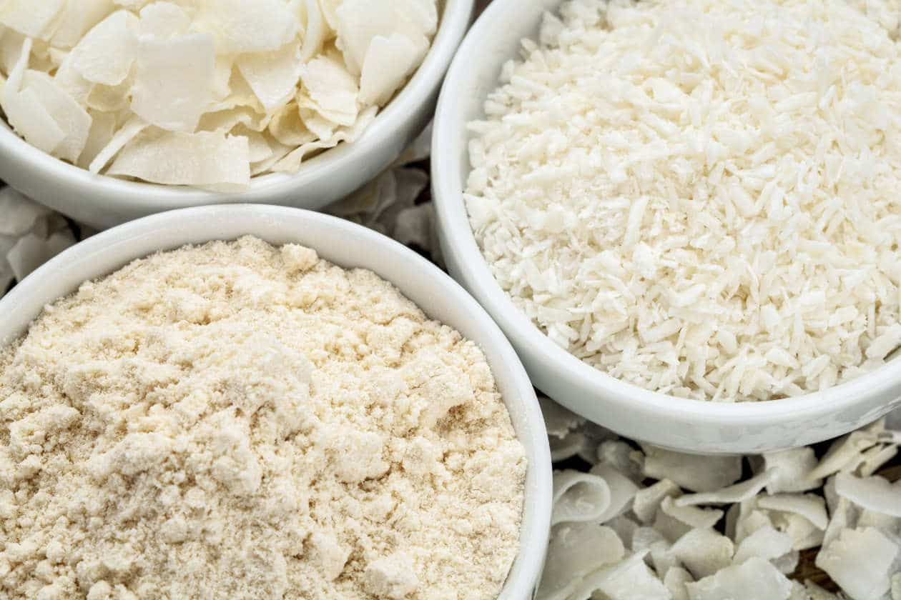
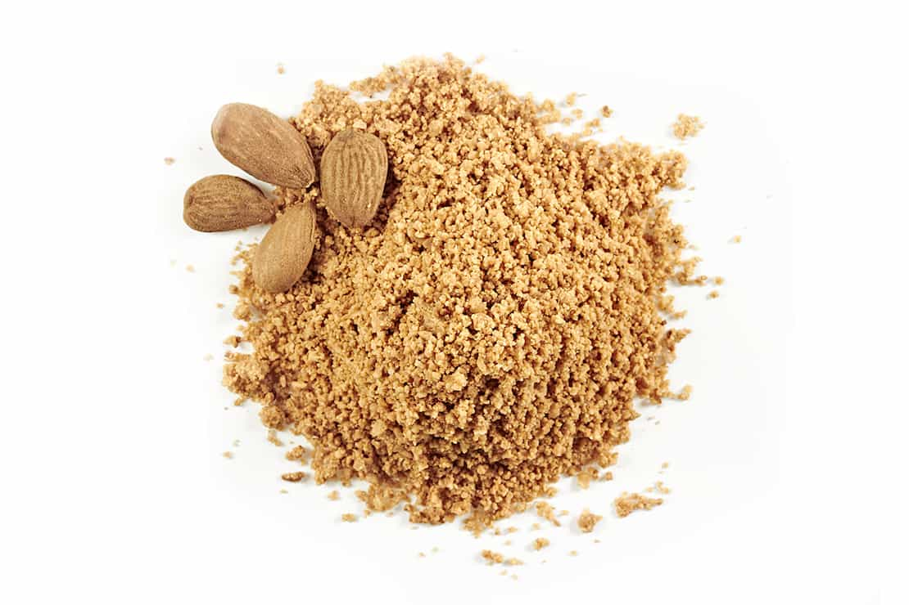
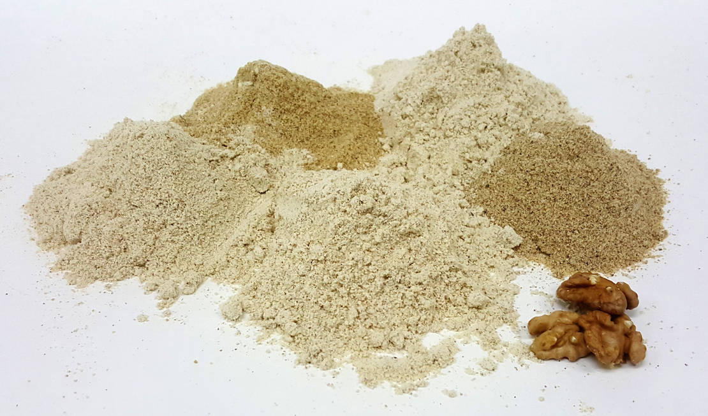

Controlar la ingesta de carbohidratos es la mejor manera de mejorar el control de la diabetes. Comer demasiados carbohidratos a la vez puede hacer que los niveles de azúcar en la sangre se alteren de manera brusca, por lo que es más difícil el controlar la diabetes. Los alimentos hechos con granos y harinas, como pan, pasta, galletas, pasteles, panecillos, croissants, tartas, panqueques y otros productos horneados, son una fuente enorme de carbohidratos en la dieta estándar. El uso de harinas bajas en carbohidratos puede ayudarle a disfrutar de sus alimentos favoritos sin comprometer sus niveles de azúcar en la sangre.

## Harinas Bajas en Carbohidratos #1: Harina de coco

La harina de coco se hace de la carne de coco después que la mayoría de la grasa se ha extraído para producir el aceite de coco. La harina de coco tiene un contenido bajo en carbohidratos y es rica en fibra, además de no tener gluten. Tendrás que modificar las recetas para agregar más líquido ya que la fibra absorbe una gran cantidad de agua. Cada 100 gramos de harina de coco contiene 535 calorías, 28,2 g de grasa, 9 g de proteína, 16 g de carbohidratos y 10,2 g de fibra. Al tener diabetes, necesitas considerar los carbohidratos netos, que corresponde a los carbohidratos totales menos la fibra. Los carbohidratos netos son los carbohidratos que pueden aumentar sus niveles de azúcar en la sangre - la fibra no genera esta reacción. En el caso de la harina de coco, su contenido neto en carbohidratos corresponde a 6,2 g por porción de 100 gramos. En comparación, la misma porción de harina de trigo para uso general contiene 76 g de carbohidratos y 2,7 g de fibra, o 73,6 g de carbohidratos netos; Y 100 gramos de harina de trigo integral tiene 72,57 g de carbohidratos y 12,2 g de fibra, o 60,4 g de carbohidratos netos[^1]

## Harinas Bajas en Carbohidratos #2: Harina de almendra

Otra forma sencilla de hacer una harina baja en carbohidratos que no eleve bruscamente los niveles de azúcar en la sangre es utilizar la harina de almendra. Puedes hacer tu propia harina moliendo almendras hasta obtener una consistencia fina como la harina. Tienes que controlar el tiempo de moler, si mueles durante demasiado tiempo terminarás haciendo mantequilla de almendras! Puedes utilizar la harina de almendra para hacer cualquiera de sus recetas favoritas, pero recuerde que debido a que no tiene gluten, no aumenta tanto. Cada 100 gramos de harina de almendra contiene 19,26 g de carbohidratos y 11,5 g de fibra, que deja sólo 7,76 g de carbohidratos netos[^2].

## Harinas Bajas en Carbohidratos #3: Harina de Nuez

Puede moler casi cualquier nuez para obtener una consistencia similar a la harina y utilizar esta "harina" para reducir el contenido de carbohidratos en las recetas. Las nueces son una buena opción, especialmente porque son ricos en ácido alfa-linolénico, un tipo de [ácido graso omega-3](/diabetes-omega-3-una-llave-inseparable/) que es bueno para la salud del corazón. Cada 1/4 taza de nueces molidas proporciona 8,6 g de carbohidratos y 4,2 g de fibra, lo que corresponde a 4,4 g de carbohidratos netos. También puede utilizar nueces de macadamia, avellanas o pistachos. Recuerde que otros ingredientes utilizados en sus recetas, como el azúcar y las frutas, pueden aumentar el contenido neto de carbohidratos de la receta.

## Otras Maneras de Reemplazar el Harina

Si necesita bajar el contenido de carbohidratos de algunas de sus recetas de productos no horneados, puede utilizar alternativas sin harina bajas en carbohidratos. Por ejemplo, para reemplazar panes y bollos usualmente utilizados para hacer sándwiches y hamburguesas, use una hoja de lechuga. Usted puede utilizar rebanadas de berenjena a la parrilla para hacer una pizza baja en carbohidratos sin tener que hacer masa de pizza. En lugar de hacer su propia pasta o el usar pasta preparada comercialmente con harina de trigo alta en carbohidratos, usa espaguetis de calabaza para reducir el consumo de carbohidratos.

[^1] ["Harina De Trigo Blanco (Multi Usos)." _FatSecret_. N.p., n.d. Web. 24 June 2017.](<https://www.fatsecret.cl/calor%C3%ADas-nutrici%C3%B3n/gen%C3%A9rico/harina-de-trigo-blanco-(multi-usos)>)
[^2] ["Harina De Almendras." FatSecret. N.p., n.d. Web. 24 June 2017.](https://www.fatsecret.cl/calor%C3%ADas-nutrici%C3%B3n/gen%C3%A9rico/harina-de-almendras)
