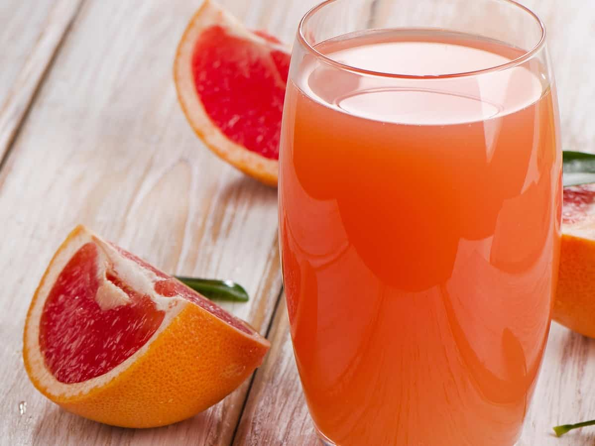

Comer más frutas frescas está vinculado a un menor riesgo de desarrollar diabetes tipo 2 y sus complicaciones relacionadas. El jugo de toronja, gracias a sus propiedades particulares, puede ser especialmente efectivo en el control del azúcar.

## Comer frutas frescas es beneficioso para la salud

Así lo reportó en este año (2017) un grupo de investigadores que estudiaron a 500.000 chinos durante siete años y encontraron que aquellos que dijeron que comían más fruta fresca tenían menos probabilidades de desarrollar diabetes tipo 2[^1]. Adicionalmente, aquellos que ya tenían diabetes pero comían mucha fruta tenían menos probabilidades de morir dentro de un período de cinco años. Este es el primer gran estudio prospectivo de adultos chinos con y sin diabetes que demostró que un mayor consumo de [frutas frescas](/frutas-buenas-para-la-diabetes/) se asoció significativamente con un menor riesgo de desarrollar diabetes, y también con un menor riesgo de morir o desarrollar complicaciones macrovasculares como infartos, [accidentes cerebro-vasculares](/diabetes-y-acv/), enfermedad vascular periférica, etc.

Este efecto se observó tanto en hombres como mujeres y además se encontró que un mayor consumo de frutas frescas no se asoció con un nivel elevado de glucosa en la sangre, por lo cual se demuestra que no es necesario que elimine la fruta de su vida si presenta diabetes, al contrario, debe hacer que por lo menos la mitad de su plato se llene de vegetales y frutas frescas.

## Beneficios del Jugo de Toronja, Pomelo o Grapefruit

Dentro de la gran variedad de frutas una de las más económicas, agradables al paladar y con muy buenos beneficios es la toronja, pomelo o grapefruit. Esta fruta no se desarrolló espontáneamente en la naturaleza, sino nació en el siglo XVIII del cruce de especies cítricas en Barbados, cien años más tarde, en 1823, se sembraron las primeras semillas de toronja en la Florida y de allí inicia toda historia de éxito y de millones de dólares ya que desde 1930 se inició la dieta de moda de la época con toronja.

Y aunque esta deliciosa fruta no tenga realmente propiedades para quemar grasa por sí misma, ni “derretir” las libras de más, si tienen múltiples propiedades comprobadas por la ciencia. Comiendo un pomelo pequeño de cerca 210g o 7 onzas usted podrá cubrir más del 100% de su requerimiento diario de vitamina C (Sin necesidad de [pastillas](/pastillas-para-la-diabetes/)), además el aporte calórico es bajo, sólo 57 Kcal en ese pomelo, también le aportará 2 g de proteínas, 10g de carbohidratos y 1 g de fibra, puede ser mayor la cantidad de fibra si usted ingiere la pequeña capa de piel blanca que se encuentra bajo la concha externa.

La toronja le ayudará a mantener controlados sus niveles de azúcar en sangre (glicemia) ya que tiene un índice glicémico muy bajo (IG = 25), de hecho, la toronja es la fruta con el valor de índice glicémico más bajo de todas las frutas que se han evaluado hasta el momento. Este efecto benéfico se debe a su contenido en ácido cítrico, vitamina C y sobre todo al aporte de fibra soluble o pectina que es capaz de absorber agua, azúcares y lípidos.

Justamente, por su contenido en fibra soluble y componentes fitoquímicos el jugo de toronja ayuda a disminuir los niveles de lípidos o grasas en la sangre, principalmente el colesterol. La fibra lo atrapa en el intestino antes de que se absorba y los fitoquímicos actúan en el hígado evitando que se produzca más colesterol en el cuerpo.

Ayuda a conservar la salud visual, lo cual es importancia para la persona con diabetes. Las toronjas tienen un color muy llamativo gracias a componentes llamados carotenoides, mientras más carotenos prosea la fruta su color es más fuerte. Estos componentes ayudan a proteger la salud visual y a la producción de vitamina A, la cual actúa principalmente en la función de la vista.

Aunque no ayuda a quemar grasa, puede intervenir en la pérdida de peso. En primer lugar porque el 90% de la toronja es agua y eso ayuda, al igual que la fibra, a que quedes saciado y por lo tanto comas menos. Adicionalmente, esta alta cantidad de agua y sus componentes fitoquímicos tienen un efecto diurético y por lo tanto, ayuda a que elimines la retención de líquido en el cuerpo.

Por su alto contenido de fitoquímicos y antioxidantes ejerce una función preventiva de las enfermedades cardiovasculares, incluso una revisión sistemática encontró que tiene un efecto benéfico al ayudar a reducir los niveles de presión arterial, vinculado a su alto contenido de potasio. Además estos mismos componentes, como la naringina y naringenina, protegen nuestro ADN del daño de radicales libres producto de una dieta poco saludable, estrés y hábitos nocivos (tabaco, alcohol) y de esta manera impiden el desarrollo de células cancerosas, especialmente en el colon, hígado y el pulmón.

Por su alto contenido de Vitamina C, ayuda a mantener al 100% la función inmune del cuerpo, manteniendo a nuestro cuerpo protegido contra de infecciones de virus o bacterias del ambiente. Además, la vitamina C, es esencial para que el cuerpo pueda formar colágeno que ayuda a que tu piel y cabello estés suaves y saludables.

## Receta de Jugo de Toronja con Frutas

Finalmente, te compartimos esta maravillosa receta de jugo de frutas especial para este verano, con una mezcla excelente de vitaminas que potencia las propiedades protectoras de la piel, las propiedades antioxidantes y las que promueven un correcto funcionamiento gastrointestinal.

### Jugo de toronja, papaya y piña.

**Ingredientes**:

1 Toronja mediana con bagazo pero sin semillas.

¾ de taza con piña y papaya.

1 Vaso de agua.

**Preparación**:

Mezcla todos los ingredientes en la licuadora y listo.

Nota: puede hacer un jugo verde al agregar perejil o celery (apio España) a su preparación. Evite el agregado de azúcar para no restar las propiedades benéficas de las frutas y disfrute al máximo del sabor natural de las frutas frescas.

¡Salud!

[^1]: PLOS. [Fresh fruit consumption linked to lower risk of diabetes and diabetic complications](https://www.sciencedaily.com/releases/2017/04/170411151024.htm). ScienceDaily. ScienceDaily, 11 April 2017.
