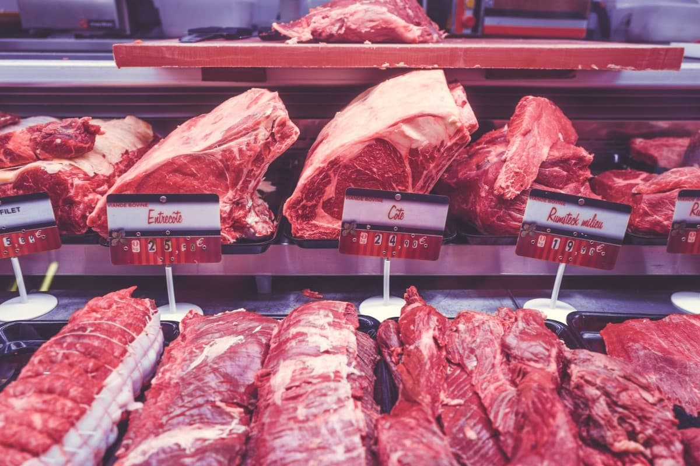

Las carnes rojas son ampliamente consumidas en las dietas occidentales, que cada día tienen más cantidad de calorías, grasas saturadas y colesterol y un menor aporte de fibra, frutas y hortalizas. En los últimos años varias investigaciones importantes han relacionado el consumo de carnes rojas con algunas enfermedades crónicas como la diabetes, enfermedades coronarias, cáncer, etc. Esta relación pudiera deberse a los componentes de las carnes como los ácidos grasos saturados y trans, el hierro hemínico, aditivos químicos y algunos productos químicos que se forman al cocinar las carnes a altas temperaturas como las aminas heterocíclicas.

## Consumo de carne rojas y la Diabetes

Un estudio recientemente publicado[^1] demostró que existe una probable vinculación entre el riesgo de diabetes tipo 2 y el consumo de productos cárnicos. Esta investigación se llevó a cabo en 63.257 adultos de China con una edad promedio de 55,2 años; de los cuales el 57,3% era mujer.

En el estudio se observó que aquellos que consumieron niveles más altos (1 ración o más al día) de carnes rojas tuvieron 23% más riesgo de desarrollar diabetes, mientras que aquellos que consumieron las partes rojas de la carne de aves de corral aumentó sólo un 15%. Esto da pie a sugerir que diferentes tipos de carne pueden tener diferentes efectos sobre el riesgo de diabetes tipo 2.

Las carnes blancas como pescados, mariscos y pechuga de pollo tienen menos hierro hem y no se asociaron con riesgo de diabetes. Esto puede deberse a su composición nutricional y además a sus diferentes métodos de cocción, por ejemplo, es común que los mariscos se sancochen o guisen mientras que las carnes se hacen a la parrilla o con métodos de muy altas temperaturas.

En la misma población china en la que se hizo el estudio, se mostró que si se reemplaza una ración de carnes rojas por una ración de pescados o marisco se disminuye el riesgo de padecer diabetes en un 26% y 22%, respectivamente.

## El alto consumo de hierro puede ser el causante

Una hipótesis desarrollada por el grupo de investigación tiene que ver con el hierro hemínico proveniente de las vísceras y carnes rojas, quien pudiera ser el responsable. Como en muchos aspectos nutricionales, el equilibrio tiene un rol fundamental. Cuando hay muy poco hierro en el organismo se puede presentar la anemia, mientras que en altas cantidades se puede acumular el hierro hemínico en el cuerpo, lo que pudiera aumentar el estado de oxidación del organismo con daño consecuente a órganos o tejidos.

Se ha visto como las [células del páncreas](/cura-para-la-diabetes-grasa-pancreas/) son especialmente sensibles al estrés oxidativo. Otros componentes de las carnes rojas son las aminas heterocíclicas que promueven la inflamación y favorecen el riesgo de presentar diabetes mellitus tipo 2.

Una limitante de la investigación es que no discriminó adecuadamente entre las carnes naturales y los productos cárnicos procesados, los cuales se ha visto que tienen marcada influencia en el proceso de salud-enfermedad. Se ha determinado que los productos procesados presentan 60% más fósforo y sodio que los naturales, debido al uso de diversas sales de sodio o de fósforo que son útiles para extender su tiempo de vida útil, mejorar la textura y preservar la humedad.

Aunque estos estudios en grandes poblaciones buscan ofrecer información al público para que tomen decisiones adecuadas basadas en evidencia científica, y que les proporcionen el menor riesgo posible; aún queda mucho por investigar y descubrir para ver si realmente esa es la concusión adecuada.

De momento, el riesgo de padecer diabetes no se trata de un alimento específico, se trata de todo un estilo de vida. Por lo tanto, no es necesario excluir un alimento de la dieta, lo importante es consumirlo en una cantidad y frecuencia adecuada (evitando los excesos) y además tener otros estilos de vida adecuados, como evitar el cigarrillo, y el exceso de alcohol, además de consumir mayores cantidades de frutas y hortalizas, a la par de realizar más actividad física cada día.

**Referencias:**

[^1]: [Eating meat linked to higher risk of diabetes](https://www.sciencedaily.com/releases/2017/09/170905134506.htm)
