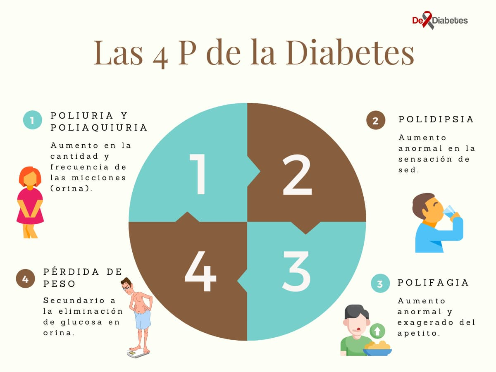

---

title: 'Aprende como Controlar la Diabetes'

date: '2021-07-29'

slug: 'como-controlar-la-diabetes'

featuredImage: 'como-controlar-la-diabetes.jpg'

featuredAlt: "aprende sobre los procedimientos para un mejor control de la diabetes"

category: "cuidado"

categories: [ 'cuidado', 'complicaciones']

authorID: 20

description: 'Si tienes diabetes, existen una serie de procedimientos para un mejor control de la diabetes que debes conocer: los cuatro pasos para el control de la Diabetes.'

---

import { ExamSangre } from '../../../constants/Tables/ExamSangre.js'

import { FormExamReal } from '../../../constants/Tables/FormExamReal.js'

import { FormBitacora } from '../../../constants/Tables/FormBitacora.js'

import PostOptIn from 'components/Subscribe/PostOptin'

La Diabetes Mellitus comprende un grupo de trastornos metabólicos, que comparten una característica principal: la elevación de los niveles de azúcar en sangre (hiperglucemia); provocando afectaciones secundarias en todos los demás sistemas del individuo afectado.

Se calcula que alrededor del mundo existen 422 millones de personas sufren de Diabetes; si eres uno de ellos, existen una serie de procedimientos para un mejor control de la diabetes que debes conocer: **los cuatro pasos para el control de la Diabetes.**

## Paso 1: Aprenda sobre la diabetes.

### ¿Qué es la diabetes?

Como se explicaba anteriormente, es un grupo de trastornos metabólicos caracterizados por la hiperglucemia, que dependiendo de la causa puede clasificarse en tres grupos principales:

1. Diabetes Mellitus Tipo 1: es resultado de la deficiencia completa o casi total de la insulina para regular los niveles de glucosa en sangre, por lo que el individuo con este tipo de Diabetes debe recibir Insulina a diario, por ello previamente se le conocía como Diabetes Insulinodependiente.
2. Diabetes Mellitus Tipo 2: es un grupo de trastornos que provoca en grados variables la resistencia a la insulina, menor secreción de dicha hormona y una mayor producción de glucosa. Previamente se le conocía como Diabetes no Insulinodependiente.
3. Diabetes Mellitus Gestacional: como su nombre sugiere, este tipo de Diabetes es propio de las mujeres embarazadas, siendo resultado de las alteraciones metabólicas propias de la gestación, que provocan resistencia a la insulina y aumento de las necesidades de esta. Aunque suele presentarse después de las 20 semanas de gestación y desaparece posterior al nacimiento, tanto la madre como los hijos tienen mayor riesgo de padecer de Diabetes Mellitus tipo 2 en el futuro.

### Su salud es lo más importante

Nadie lo conoce mejor que usted mismo, todo paciente que sufre de Diabetes Mellitus debe estar en constante contacto con su médico y recibir seguimiento frecuente de su enfermedad, además de recibir apoyo psicosocial permanente. Estos son algunas de las personas que debes contactar:

- Diabetólogos.
- Nutricionistas.
- Nefrólogos.
- Ortopedistas.
- Oftalmólogos.
- Psicólogos.
- Grupos de ayuda.

### ¿Dónde aprender más sobre la Diabetes?

Desde que los servicios online han invadido la vida diaria, la cantidad de sitios en los que informarse sobre la diabetes es vasta y muy variada, tu deber es asegurarte que la información que encuentres sea científicamente correcta, de calidad y, principalmente, que sea la que tu necesites. No dudes en buscar más información en dediabetes usando nuestro sistema de [filtro de artículos](/articles) para facilitar tu búsqueda.

Aunque internet es un medio rápido y accesible, recuerda siempre consultar con tu médico de confianza o con personal de salud disponible, no dudaran en responder las preguntas que tengas sobre esta enfermedad.

### La Diabetes es un problema que debe ser tomado en serio

A pesar que esta enfermedad es un padecimiento ampliamente estudiado, muchas veces se subestima. Hay una gran cantidad de personas que creen que no les afectará y dicen &quot;voy a comer lo que quiera&quot; o &quot;tuvo azúcar alta antes, pero ya se curó&quot;.

La verdad es que la Diabetes Mellitus es un problema grave de salud mundial, por el impacto negativo sobre la calidad de vida de los que la padecen y por los altos costos económicos que conlleva su tratamiento; esta enfermedad es un problema crónico que debe ser tratado con seriedad y de manera estricto, porque de lo contrario provocará complicaciones catastróficas a corto y largo plazo.

Por esto, el manejo de un paciente diabético debe abarcar múltiples aspectos de salud y de la vida diaria: tomar la medicación adecuada de manera permanente, mantener una dieta adecuada y balanceada, y realizar la actividad física necesaria. Esto es una carrera de resistencia en la que debes tener la voluntad y disciplina para hacerla, al final los resultados valdrán la pena.

### Beneficios de un buen control de la diabetes

Cuando se consigue un buen control en los niveles de glicemia (azúcar en sangre), tu calidad de vida mejorara drásticamente y experimentarás una serie de cambios beneficiosos y significativos, que notarás inmediatamente como:

- Mejora de los síntomas que aparecieron al inicio de tu enfermedad.
- Disminución del riesgo de sufrir complicaciones propias de la Diabetes, como la Cetoacidosis Diabética.
- Disminución del riesgo de sufrir complicaciones cardiovasculares.
- Disminución del riesgo de sufrir complicaciones renales.
- Disminución del riesgo de sufrir complicaciones oftalmológicas.
- Mejora del estado físico.
- Mejora de la salud mental.
- Mejora de la salud sexual.

<PostOptIn/>

## Paso 2: Conozca los factores clave de la Diabetes Mellitus.

Hay muchos factores claves que debes conocer sobre este padecimiento, desde conocer los síntomas hasta las pruebas que se realizan para realizar su diagnóstico.

### Los síntomas cardinales de la Diabetes: Las 4 P de la Diabetes.

- Poliuria y poliaquiuria: aumento en la cantidad y frecuencia de las micciones (orina).
- Polidipsia: aumento anormal en la sensación de sed.
- Polifagia: aumento anormal y exagerado del apetito.
- Pérdida de peso: secundario a la eliminación de glucosa en orina.

### Pruebas diagnósticas de la Diabetes Mellitus

**Glicemia en ayunas** : esta prueba mide los valores de azúcar en sangre después de un ayuno mínimo de 8 horas. Siendo sus valores:

- Normal: menor o igual a 99 mg/dL.
- Prediabetes: 100 a 125 mg/dL.
- Diabetes: mayor o igual a 126 mg/dL.

**Prueba de tolerancia a la glucosa** : esta prueba es un procedimiento escalonado de medición de la glicemia en la que se administran dosis de glucosa por vía oral, siendo el criterio diagnostico un resultado de glicemia igual o mayor a 200 mg/dL posterior a una ingesta de 75 gramos de glucosa.

**Hemoglobina Glicosilada (HA1C)**: es una prueba en sangre que mida los niveles de glucosa en sangre en los últimos 3 meses, siento útil no solo para diagnóstico, sino también para control. Siendo sus valores:

- Normal: menor a 5.7%.
- Prediabetes: 5.7% a 6.4%.
- Diabetes: mayor o igual a 6.5%.

**Glicemia al azar** : una prueba de glicemia realizada al azar con valor mayor o igual a 200 mg/dL, es efectiva para diagnóstico de Diabetes Mellitus.

### Otros factores a tener en cuenta

Tensión arterial (presión sanguínea): se define como la fuerza que ejerce la sangre sobre las arterias y se mide en milímetros de mercurio (mm/Hg), pero ¿por qué es importante? La Diabetes Mellitus aumenta el riesgo de padecer de enfermedades cardiovasculares como la hipertensión arterial, así como otras enfermedades cardiacas, renales y pulmonares. Una persona diabética debe mantener una tensión arterial ideal de 130/80 mm/Hg.

_Colesterol_

La Aterosclerosis es una enfermedad lenta y progresiva que provoca las arterias (vasos sanguíneos) pierdan elasticidad y sufran de rigidez, esta enfermedad se encuentra directamente relacionada con los altos niveles de colesterol.

¿Por qué el colesterol causa esto? El colesterol puede acumularse en las arterias y formar placas, las cuales con el tiempo se endurecen y causan rigidez en los vasos sanguíneos.

¿Qué puede causar la Aterosclerosis? La Aterosclerosis es responsable de muchas enfermedades graves como:

- Angina (dolor en el pecho).
- Infarto agudo al miocardio.
- Ictus (accidente cerebrovascular o &quot;derrame cerebral&quot;).
- Síndrome coronario.

A pesar que esto puede sonar desalentador, no todo el colesterol es malo, para esto hay que entender que existen dos tipos de colesterol:

- LDL (Ácidos Grasos de Baja Densidad, por sus siglas en inglés): este tipo de ácidos grasos son conocidos como los &quot;malos&quot;, ya que son los que se acumulan y pueden provocar Aterosclerosis. Siendo su valor normal menor a 115 mg/dL.
- HDL (Ácidos Grasos de Alta Densidad, por sus siglas en inglés): este otro tipo de ácidos grasos son conocidos como los &quot;buenos&quot;, ya que si se mantienen en un valor optimo ayudan a la eliminación de los LDL. Siendo su valor normal mayor de 40 mg/dL en hombres y mayor de 45 mg/dL en mujeres.

### Consejos

Mantén comunicación proactiva con tu médico, para que lleves registro de los siguientes datos:

- Tu tensión arterial normal y los valores que debes mantener.
- Tu nivel de glicemia normal y tu monitoreo continuo.
- Tus niveles de colesterol objetivo.

<PostOptIn/>

## Paso 3: Aprenda a vivir con la Diabetes.

Después de haber leído todo lo anterior, es normal estar decepcionado y frustrado. Pero, recuerda que siempre hay una luz al final del túnel y siempre hay una manera de seguir adelante. En este paso, te mostraremos la mejor manera de convivir con esta enfermedad y no tener limitaciones en tu vida diaria.

### ¿Qué debes hacer?

- La primera acción que debes tomar es aceptar que sufres de Diabetes Mellitus, entre más te tardes en saber de tu enfermedad, más complicaciones te causará.
- No te estreses pensando en que sufres de Diabetes, el estrés es una de las principales causas de elevación del azúcar en sangre. ¿Por qué controlar el estrés es tan importante? Cuando te estresas tu cuerpo libera una hormona llamada Cortisol, la cual eleva los niveles de glucosa en sangre.
- Pon atención especial a las 4 P de la diabetes (descritas en el Paso 2), que son los síntomas que te dirán si tus niveles de glucosa están elevados.
- Haz ejercicio de manera continua y realiza actividades que beneficien tu salud física.
- Mantén una alimentación balanceada, no te satures con alimentos ricos en carbohidratos, grasas y azucares, porque estos aumentaran tus niveles de glucosa en sangre. Aliméntate con alimentos ricos en fibra como: cereales, pan integral, frutas y verduras.
- Come pescado, es rico en proteína y tiene un bajo porcentaje de carbohidratos, además que contiene Omega 3, no solo te ayudará con tu Diabetes, también lo hará con tu sistema nervioso y con tu sistema cardiovascular.
- Toma agua en cantidades necesarias y de manera regular.

### La actividad física es clave

- Los ejercicios físicos son de vital importancia para mantener a raya tus niveles de azúcar en sangre, ya que ayudan a quemar carbohidratos y grasas de tu cuerpo.
- Sal a caminar 10 minutos al día para mantener tu sistema cardiovascular en óptimas condiciones.
- Haz yoga y ejercicios de relajación, recuerda que evitar el estrés es esencial.
- Monitorea tu peso, recuerda que la obesidad es uno de tus peores enemigos.

### Ten constancia de tu día a día

- Ten a mano una lista de los medicamentos que debes tomar. Anota si tu medico te ha agregado nuevos medicamentos a tu lista; y hazle saber si has tenido un problema con ellos.
- Monitorea tus niveles de glucosa en sangre, para saber si tu Diabetes está controlada.
- Examina tus pies a diario: toda persona que sufre de Diabetes, tiene riesgo de sufrir de Pie Diabético. Examina tus pies en busca de lesiones, ampollas u hongos.
- Lávate los dientes a diario, según recomiende tu odontólogo.
- Ten números de emergencia a mano para llamar en caso que presentes alguna eventualidad.

### ¿Cómo puedo hacer todo esto?

- Pide un plan de alimentación a tu nutricionista.
- Pide un plan de ejercicios.
- Pide una guía de monitoreo de glucosa en sangre.
- Realízate exámenes médicos con frecuencia o como indique tu médico.

## Paso 4: Obtenga los cuidados médicos de rutina para mantenerse sano.

Visita a tu medico con regularidad, como mínimo dos veces al año.

### ¿Para qué visitar a tu médico?

- Verificar que tu Diabetes esté controlada.
- Monitorear tu tensión arterial.
- Monitorear la evolución de tu peso corporal.
- Valorar si necesitas exámenes de rutina.
- Revisar tus notas y listas de monitoreo.
- Examinarte en busca de complicaciones.

### La importancia de la Hemoglobina Glicosilada (HA1C)

Si no presentas síntomas asociados a un aumento de tus niveles de azúcar en sangre, puedes realizarte este examen dos veces al año en intervalo de seis meses. Pero si has presentado episodios de descompensación, deberás realizarte esta prueba cada tres meses.

### Las vacunas salvan vidas

Solicita a tu médico que te apliquen las vacunas necesarias para pacientes de riesgo:

- Vacuna contra la Influenza.
- Vacuna contra el Tétano.
- Vacuna contra la Fiebre Amarilla.
- Vacuna contra la Hepatitis.
- Vacuna contra el COVID-19.

### Herramientas de registro para el control de la Diabetes

Tabla de monitoreo de la tensión arterial

<ExamSangre/>

Monitoreo de exámenes de sangre

<FormExamReal/>

Bitácora de medicamentos 

<FormBitacora/>

## Otras cosas a tener en cuenta

_Si eres fumador, dejarlo te dará los siguientes beneficios:_

- Disminuye el riesgo de sufrir un infarto, accidente cerebrovascular, enfermedades renales y enfermedades cardiovasculares.
- Mejorar tu nivel de colesterol y tu tensión arterial.
- Mejorar tu circulación sanguínea.
- Ayuda a mantener mejor actividad física, disminuyendo el cansancio.

### Conoce las complicaciones de la diabetes:

- Pie diabético: es una de las complicaciones más frecuentes de la Diabetes cuando hay un mal control de los niveles de glucosa en sangre; se produce daño en los nervios y vasos sanguíneos de los pies, lo que provoca una ulceración en el pie.
- Neuropatía diabética: cuando los niveles de glucosa se mantienen elevados, este daña los nervios periféricos, lo que provoca síntomas de dolor, sensación de hormigueo y perdida de la sensibilidad.
- Retinopatía diabética: los niveles elevados de glucosa en sangre dañan los nervios de los ojos, lo que provoca perdida de la visión, visión borrosa y dolor ocular.
- Nefropatía diabética: los niveles elevados de glucosa en sangre dañan al riñón, impidiendo que este pueda realizar sus funciones de filtrado de manera adecuada.
- Síndrome metabólico: la Diabetes Mellitus sin controlar puede llevar a un mal control de tus ácidos grasos y aumenta el riesgo de sufrir de obesidad.

<PostOptIn/>

### Control riguroso de la diabetes

El control riguroso de la Diabetes es un método de control que se realiza mediante la aplicación continua y estricta de Insulina, se utiliza principalmente con pacientes que sufren Diabetes Mellitus Tipo 1 y Diabetes Mellitus Tipo 2 que no responden bien a los tratamientos de rutina, existen dos métodos:

- Inyecciones diarias múltiples: se aplican 3 o más inyecciones de insulina por día, generalmente con las comidas.
- Bomba de insulina: el paciente se conecta a una bomba de insulina de liberación lenta.

Si tienes problemas para controlar tu Diabetes, consulta con tu médico si eres elegible para este tipo de terapia.

### Adopta las nuevas tecnologías

La edad no es un factor que limite el uso de nuevas tecnologías de comunicación. Aunque es un tema poco abordado, cuando se habla de Diabetes, la tecnología juega un papel importante en la participación proactiva del paciente, veamos como lo haces:

- El acceso a artículos de calidad sobre Diabetes ha crecido exponencialmente con la llegada de internet.
- Una app puede salvar tu vida: en los últimos años, un teléfono inteligente puede almacenar y ejecutar aplicaciones que te ayudaran a tener un mejor monitoreo de tu Diabetes.
- Glucotest: si deseas mantener un control estricto de tus niveles de azúcar en sangre, con un Glucómetro puedes medir de manera rápida y sencilla tu nivel de Glucosa en sangre en el momento que lo desees.
- Telemedicina: en los tiempos que corren, hay muchas aplicaciones médicas que te permiten tener contacto con tú médico, simplemente con poseer un servicio de internet.

### ¿Quiénes tienen riesgo de padecer de diabetes?

Aunque todos tenemos riesgo de sufrir de Diabetes Mellitus, hay ciertas condiciones que aumentan el riesgo de sufrir de esta enfermedad.

**Etnia:** ciertos grupos poblacionales tienes mayor riesgo de sufrir de Diabetes, en orden de frecuencia se señalan:

1. Afroamericanos
2. Nativos de Alaska
3. Indígenas estadounidenses
4. Estadounidenses de origen asiático
5. Hispanos o latinos
6. Nativos de Hawái
7. Nativos de las Islas del Pacífico

**Antecedentes familiares:** las mujeres con antecedentes familiares de Diabetes tienen riesgo aumentado de sufrir de Diabetes Gestacional.

**Condiciones hormonales:** la menopausia o el hipertiroidismo, pueden provocar trastornos hormonales que afecten la secreción de insulina lo cual, a su vez, aumenta los niveles de glucosa en sangre.

**Medicamentos:** algunos medicamentos pueden provocar el aumento de los niveles de azúcar en sangre, como los medicamentos de uso psiquiátrico, los medicamentos para tratar el VIH o los corticoides como la dexametasona.

### ¿A qué edades se manifiesta la Diabetes?

- La Diabetes Mellitus Tipo 1 puede desarrollarse en edades muy tempranas, con frecuencia en edades menores a 40 años.
- La Diabetes Mellitus Tipo 2 se puede manifestar a cualquier edad, pero lo hace con mayor frecuencia en las personas mayores de 45 años.

### Diabetes Mellitus y salud sexual

- Los hombres con diabetes puedes sufrir de disfunción eréctil 10 a 15 años antes que una persona que no sufre de la enfermedad.
- Las personas que sufren de Diabetes, sufren una disminución significativa del deseo sexual.
- Las personas que sufren de Diabetes tienen mayor riesgo de sufrir de infertilidad en el futuro.
- Los hombres que sufren de Diabetes son más propensos a sufrir la enfermedad de Peyronie, que es la formación de tejido cicatricial en el pene, lo que provoca que este tenga una curvatura anormal.
- Las mujeres que sufren de Diabetes tienen una respuesta sexual disminuida, respecto a las mujeres que no sufren la enfermedad.
- Las mujeres que sufren de Diabetes pueden sufrir problemas de lubricación vaginal.
- Las mujeres que sufren de Diabetes pueden tener poca sensibilidad en los órganos genitales.
- Las personas que sufren de Diabetes pueden sufrir dolor durante las relaciones sexuales.
- Las personas que sufren de Diabetes pueden sufrir de infecciones genitales a repetición.

### Diabetes Mellitus y COVID-19

- Las probabilidades de sufrir complicaciones por COVID-19 son mayores en pacientes que sufren de Diabetes Mellitus.
- Consulta a tu médico inmediatamente en caso de presentar síntomas de tipo respiratorio.
- Toma todas las medidas higiénico sanitarias recomendadas.
- El 20% de las personas hospitalizadas por COVID-19 sufren de Diabetes.
- El 26% de las personas fallecidas por COVID-19 sufrían de Diabetes.

### Datos clave

- Aproximadamente un tercio de personas que sufren de Diabetes Mellitus Tipo 2 no están diagnosticadas y ya presentan complicaciones en el momento del diagnóstico.
- Una persona con Diabetes tiene un gasto económico 3 veces mayor que uno sin Diabetes.
- El riesgo de morir de una Enfermedad cerebrovascular es 3 veces mayor en alguien que sufre de Diabetes que en alguien que no sufre la enfermedad.
- La Diabetes mal controlada reduce la esperanza de vida de manera signicativa.
- La obesidad aumenta 10 veces la probabilidad de sufrir de Diabetes Mellitus en el futuro.

<div className="mt-8 bg-gray-400">  

**Referencias:**

[4 Pasos para controlar la diabetes de por vida | NIDDK (nih.gov)](https://www.niddk.nih.gov/health-information/informacion-de-la-salud/diabetes/informacion-general/control/4-pasos-controlar-vida)

[Aterosclerosis | NHLBI, NIH](https://www.nhlbi.nih.gov/health-topics/espanol/aterosclerosis)

[Problemas de la diabetes, sexuales y de la vejiga | NIDDK (nih.gov)](https://www.niddk.nih.gov/health-information/informacion-de-la-salud/diabetes/informacion-general/prevenir-problemas/sexuales-urologicos)

[Si tengo diabetes, ¿qué debo saber acerca de la COVID-19? 21 de mayo del 2020 (paho.org)](https://bit.ly/3yO0ldA)

[Diabetes - OPS/OMS | Organización Panamericana de la Salud (paho.org)](https://bit.ly/3n9lHzU)

[Síntomas y causas de la diabetes | NIDDK (nih.gov)](https://www.niddk.nih.gov/health-information/informacion-de-la-salud/diabetes/informacion-general/sintomas-causas)

[¿Qué es la diabetes tipo 1? | CDC](https://www.cdc.gov/diabetes/spanish/basics/what-is-type-1-diabetes.html)

[38.- Nuevas tecnologías y diabetes (redgdps.org)](https://www.redgdps.org/guia-de-diabetes-tipo-2-para-clinicos/38-nuevas-tecnologias-y-diabetes-20180917)

[Pie diabético - Federación Española de Diabetes FEDE (fedesp.es)](https://fedesp.es/diabetes/complicaciones/pie-diabetico/)

[Síndrome metabólico: MedlinePlus en español](https://medlineplus.gov/spanish/metabolicsyndrome.html)

[Control riguroso de la diabetes: American Diabetes Association®](http://archives.diabetes.org/es/vivir-con-diabetes/tratamiento-y-cuidado/el-control-de-la-glucosa-en-la-sangre/control-riguroso-de-la-diabetes.html)

  
