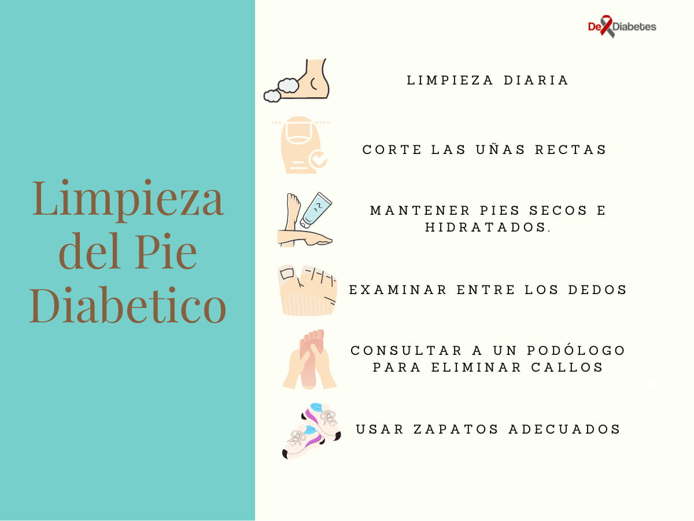
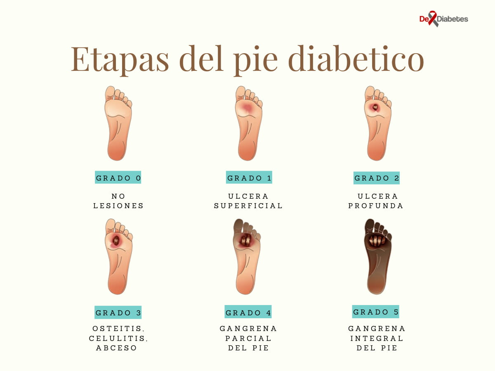

---

title: 'Pie Diabetico'

date: '2021-09-17'

slug: 'pie-diabetico'

featuredImage: 'images/pie-diabetico.jpg'

featuredAlt: "Las personas con diabetes pueden ser propensas a tener problemas de pie diabetico"

category: "complicaciones"

categories: ['complicaciones']

type: articulo

featured: 'yes'

authorID: 28

expertID: 1

verified: true

description: 'Las personas con diabetes, especialmente aquellas que tienen un mal control metabólico y permanecen con niveles altos de glicemia por períodos prolongados, son propensas a tener problemas de pie diabetico. Esta condición puede pasar por diferentes etapas de deterioro dependiendo del grado de lesion en la escala wagner.'

---

import { PieDiabetico } from '../../../constants/Tables/PieDiabetico.js'

import Alert from '@material-ui/lab/Alert';

import PostOptIn from 'components/Subscribe/PostOptin'

Las personas con diabetes, especialmente aquellas que tienen un mal control metabólico y permanecen con niveles altos de glicemia (azúcar en la sangre) por períodos prolongados, son propensas a tener problemas en el pie. El pie diabetico es una complicación crónica que puede llevar a la amputación.

Las llagas en el pie son una complicación común en pacientes con diabetes que no se apegan a las indicaciones médicas. Estas se forman como resultado de la ruptura del tejido de la piel y la exposición de las capas inferiores.

Son más comunes debajo de los dedos gordos y las puntas de los pies, pero pueden afectar el resto de los pies hasta posible infección del hueso. No obstante, un buen cuidado de los pies puede ayudar a prevenir todas estas complicaciones.

Según la **Asociación Americana de la Diabetes (ADA)**[^1], la diabetes es responsable de más del 50% de todas las amputaciones de las extremidades inferiores (especialmente del pie) en los Estados Unidos, por esta razón, es de vital importancia mantener adecuados niveles de glucosa y tener un óptimo cuidado del pie.

## ¿Qué Causa el Pie Diabético o Pié de Charcot?

Los dos problemas principales que afecta el pie en las personas con diabetes son:

### A. Neuropatía Diabética

La neuropatía periférica diabética puede adormecer el pie, lo que reduce la conciencia de heridas, infecciones y zapatos apretados. A largo plazo, el daño de los nervios que ocasiona la diabetes, puede causar la disminución de la sensibilidad de las extremidades y hacer que la persona pierda el sentido del tacto en el pie.

En consecuencia, el paciente diabético tendrá dificultades para sentir dolor e irritación en el pie. De hecho, es probable que ni siquiera se de cuenta cuando sus zapatos rocen, froten y lastimen su piel. Esta falta de sensibilidad puede aumentar el riesgo de cortaduras, llagas y ampollas.

Si una persona no recibe tratamiento para una infección, se pueden desarrollar úlceras diabéticas e incluso muerte de los tejidos del pie, lo que se conoce como gangrena.

### B. Enfermedad vascular periférica

La diabetes provoca cambios en los vasos sanguíneos, principalmente en las arterias. En la enfermedad vascular periférica, se forman depósitos de grasa que pueden bloquear los vasos sanguíneos a lo largo de todo el cuerpo humano.

Tiende a afectar los vasos no solo del cerebro y el corazón, sino aquellos que van hacia y desde las extremidades, como las manos y los pies, reduciendo el flujo sanguíneo y en consecuencia, el transporte de nutrientes, oxígeno y anticuerpos.

La reducción del flujo sanguíneo puede provocar dolor, infecciones y enlentecer la cicatrización de las heridas. Todo esto entorpece la curación de las llagas y prolonga los procesos infecciosos en el tiempo.

## Síntomas de la Diabetes en los Pies

Los síntomas de la diabetes en el pie varían de una persona a otra y puede depender de los problemas específicos que la persona esté experimentando en ese momento. Sin embargo, los síntomas de un pie diabético puede incluir[^2]:

### - Cambios de la piel

La diabetes mellitus puede causar cambios en la piel de su pie. A veces tu pie puede volverse muy seco. La piel puede pelar y agrietarse. Este problema es causado por el daño a los nervios que afecta la capacidad de su cuerpo para controlar el aceite y la humedad en su pie. Después de bañarse, secar los pies y sellar la humedad restante con una capa delgada de jalea de petróleo simple, una crema de mano sin perfume u otros productos de este tipo. No ponga aceites o cremas entre los dedos de los pies. La humedad extra puede llevar a la infección. Además, no empape a los pies, eso puede secar la piel.

### - Callos

Los callos se producen con más frecuencia y se acumulan más rápido en los pies de las personas con diabetes. Esto se debe a que hay áreas de alta presión debajo del pie. Demasiado callo puede significar que necesitará zapatos e inserciones terapéuticos. Los callos, si no se recortan, se vuelven muy gruesos, se descomponen y se convierten en úlceras (llagas abiertas).

**Nunca intente cortar callos o callos usted mismo**, esto puede llevar a llagas e infecciones. Deje que un profesional de la salud en su equipo de cuidado de la diabetes corteje sus callos.

Además, **no intente eliminar callos y callos con agentes químicos**. Estos productos pueden quemar la piel.

Usar una piedra pómez todos los días ayudará a mantener los callos bajo control. Es mejor usar la piedra pómez en la piel húmeda. Ponte loción justo después de usar la piedra pómez.

### Otras Síntomas

- Pérdida de la sensibilidad en el pie
- Cambios de temperatura en el pie
- Entumecimiento u hormigueo en el pie
- Ampollas u otras heridas en ausencia de dolor
- Heridas con o sin drenaje
- Mancha en los calcetines

<Alert variant="outlined" severity="error">
  La Asociación Americana de la Diabetes (American Diabetes Association, ADA) recomienda consultar a su proveedor de atención médica si tiene algún corte o lesión en la piel, o si desarrolla un crecimiento interno de una uña del pie. Además, la ADA afirma que si sus pies cambian de color, forma, o simplemente se sienten "raros" (por ejemplo, si duelen o se pierde la sensación en ellos), debe comunicarse con su proveedor de atención médica.
</Alert>

## Diagnóstico

Una de las primeras alarmas de úlceras en el pie, es cuando sus secreciones ensucian y dejan manchas en los calcetines, y en algunos casos, hasta en los zapatos. Además, la hinchazón, la irritación, el enrojecimiento y los olores inusuales de uno o ambos pies también son síntomas tempranos comunes.

El signo más visible de una úlcera grave en el pie es el tejido negro que la rodea. A esto se le conoce como escara y no es más que la muerte del tejido en el pie debido a infección. En este punto, se pueden liberar secreciones fétidas acompañadas de dolor y entumecimiento.

Los signos de úlceras en el pie no siempre son obvios. A veces, ni siquiera mostrará síntomas de úlceras hasta que se haya infectado.

## Prevención y Cuidado de los Pies

El cuidado preventivo de los pies en pacientes con diabetes, es una medida imprescindible. Según un artículo reciente de la prestigiosa revista New England Journal of Medicine: _más de la mitad de las úlceras del pie diabético se infectan._

La infección es un riesgo elevado en una persona con diabetes: **_Una de cada cinco infecciones graves de pie diabético conducen a la amputación_,** por esto, la atención preventiva de la ulceración en el pie es fundamental.

El control de la glucosa en sangre (azúcar en la sangre) es indispensable, ya que mientras mayor sean los niveles de glicemia en el tiempo, mayores serán las posibilidades de complicaciones.

### Higiene de los pies[^3]

#### Limpieza

- Limpieza diaria de los pies
- Utilice agua templada entre 32-35 ºC. 
- Verifique la temperatura del agua con un termómetro de baño o con el codo.
- Utilice jabón neutro.
- No deje los pies en agua más de 5 minutos, para evitar que la piel se macere. Utilice una manopla de baño suave.
- No use cepillos y mitones ásperos o de crin que puedan lesionar la piel.
- Debe lavar todo el pie con especial atención entre los dedos

Advertencia: El paciente puede tener neuropatía y disminuida su sensibilidad y puede no percatarse de la temperatura. Incluso el agua demasiado caliente puede quemarte sin que te des cuenta.

#### Secado
- Seque bien los pies y mantenerlos secos.
- Utilice una toalla suave e insistiendo entre los dedos.

#### Hidratación
- Incorporar cremas hidratantes en el cuidado de los pies.
- Si tiene la piel reseca aplíquese una fina capa de pomada o loción hidratante en las plantas y sobre las zonas resecas, pero nunca entre los dedos de los pies.
- La piel húmeda y macerada facilita el crecimiento de hongos y la aparición de infecciones.

<PostOptIn/>

#### Cuidado de las Uñas
- Cortar las uñas para mantenerlas adecuadamente recortadas. Uñas muy cortas o mal cortadas pueden dar problemas y causar heridas e infecciones.
- Corte las uñas utilizando tijeras con punta roma para no hacerse cortes.
- El mejor momento es después del lavado de los pies, cuando están más blandas.
- Corte las uñas rectas: con los bordes rectos y sin cortar las esquinas y suavice las puntas con una lima de cartón. No las corte demasiado: deje que sobresalga 1 mm por delante del pulpejo del dedo.
- Si tiene problemas de visión o de habilidad, pida ayuda a un familiar o acuda a un podólogo, en especial si sus uñas son gruesas y duras.

### Examen diario

Después del lavado, debe examinar a diario los pies. Debe sentarse y tener buena iluminación. Si tiene dificultades puede ayudarse con un espejo irrompible o pedir a algún familiar que examine sus pies sobre todo si tiene problemas de visión. Debe prestar atención a:
- lesiones entre los dedos
- Durezas en la planta del pie
- Callosidades
- Grietas
- Ampollas
- Cambios de coloración
- Heridas o úlceras, etc.

### Calzado

- Deberá usar siempre calzado y calcetines o medias.
- No camine nunca descalzo, ni siquiera dentro de su casa.
- El calzado adecuado será de material transpirable (cuero o lona), ligero y flexible, con suela antideslizante y no demasiado gruesa, no debe tener costuras interiores y el tacón será de una altura discreta (menos de 5 cm). 
- No utilice zapatos de plástico ni materiales que impidan que el pie “respire”.
- Tampoco se aconseja utilizar sandalias porque dejan desprotegidos los dedos y el talón.
- Al adquirir zapatos, asegúrese de que sean cómodos desde el principio, ni demasiado flojos ni apretados y nunca los compre esperando estirarlos.
- Cuando estrene zapatos, comience a usarlos poco a poco; unos días antes póngaselos en casa durante ratos de media hora, aumentando progresivamente el tiempo.
- Las medias y calcetines deben ser suaves, preferiblemente de algodón, hilo o lana, sin costuras ni dobleces. No use ligas ni elásticos apretados, porque dificultan la circulación.
- Airee y mantenga secos sus zapatos y cambie diariamente los calcetines o medias.

### Lo que no puede hacer

- No acerque sus pies al fuego, estufas o radiadores, ni utilice bolsas de agua caliente o mantas eléctricas para calentarlos.
- No caminar descalzo.
- No aplique remedios caseros ni pomadas callicidas, ni utilice objetos cortantes como hojas de afeitar para eliminar durezas o callosidades, acuda a un podólogo para eliminar callos.
- No utilice zapatos apretados, ni fajas, ni ligas o elásticos que dificulten la circulación.
- No fume.

## Factores de riesgo

Todas las personas con diabetes corren el riesgo de desarrollar llagas, lesiones, o una herida en el pie debido a la diabetes. Sin embargo, algunos de los siguientes factores pueden aumentar el riesgo:

- Zapatos mal ajustados o de mala calidad
- Mala higiene
- Corte inadecuado de las uñas de los pies
- Consumo de alcohol
- Enfermedad cardíaca
- Enfermedad renal
- Obesidad
- Tabaquismo

## Etapas del Progreso de la Neuropatía en el Pie Diabetico

Hay _cinco etapas_ asociadas con la neuropatía en el pie. Aquí las enumeramos para ayudar al lector a determinar su propia situación y, con suerte, tomar medidas para implementar buenos hábitos de cuidado del pie, aprenda cómo controlar más daños y vivir un estilo de vida saludable.

1.  **Primera etapa:** conocida como "formación"; sentirás una sensación de hormigueo o de abejas picándote en la planta del pie. Puede haber una sensibilidad extrema al toque, incluso hasta el punto de las sabanas de la cama te causen incomodidad. Si tienes diabetes y empiezas a notar estos síntomas, es imperativo informarlo inmediatamente para evitar una mayor neuropatía.
2.  **Segunda etapa:** Las sensaciones en el pie se hacen más fuertes y se producen más a menudo.
3.  **Tercera etapa:** El problema puede despertarte de tu sueño. Puede haber una sensación de ardor constante en el pie.
4.  **Cuarta etapa:**  Ahora hay algunos momentos de alivio del dolor en el pie. Lamentablemente, esto no indica ninguna mejora, la neuropatía está progresando en períodos de entumecimiento.
5.  **Quinta etapa:** una completa pérdida de sensación en el pie. Esto es cuando es probable que se desarrollen úlceras en el pie.

Normalmente para clasificar las úlceras del pie diabético se utiliza la escala de clasificación Wagner (a veces denominado Merritt-Wagner), que constituye la base para el plan de tratamiento en  el pie. Esta escala comprende seis grados de úlcera que van desde 0 a 5\. Según el grado en que se encuentre el pie del paciente, el especialista puede entender la gravedad, profundidad, infección y gangrena. Los grados son los siguientes[^4]:

<PieDiabetico/>

Aunque es raro, el daño a los nervios de la diabetes puede llevar a cambios en la forma de sus pies, como el **Pie de Charcot**. El pie de charcot es una afección progresiva que puede comenzar con hinchazón y/o enrojecimiento en el pie, el pie se nota caliente al tacto. Más tarde, ataca a los huesos, las articulaciones y a los tejidos blandos y puede hacer que se formen llagas en los pies o que el pie cambie de forma.

## Tratamiento

El primer paso que debe tomar cualquier diabético es un buen control general de la diabetes:

- Llevar los niveles de azúcar en sangre dentro de un rango óptimo acordado por el médico
- Mantener los niveles de presión arterial
- Colesterol dentro de los limites saludables.

Un médico primero intentará tratar los problemas del pie diabético en un paciente sin necesidad de cirugía. Algunos métodos incluyen mantener las heridas limpias y vendadas, y usar dispositivos de inmovilización, como una bota de yeso o un yeso de contacto total.

### Medicamentos

Además, el médico puede recetar al paciente antibióticos, antiplaquetarios o medicamentos anticoagulantes para tratar la úlcera si la infección progresa incluso después de tratamientos preventivos.

### Tratamiento quirúrgico

Cuando el tratamiento no quirúrgico no cura con éxito los problemas del pie , se puede considerar la cirugía. Las opciones quirúrgicas para un paciente incluyen:

- Eliminación o desbridamiento del tejido en descomposición o muerto en el pie.
- Amputación, que va desde el dedo del pie o secciones del pie hasta amputación de la pierna por debajo o incluso por encima de la rodilla.
- Realización de bypass arterial para la enfermedad vascular periférica, lo que ayuda al flujo sanguíneo del área afectada en el pie.
- Cirugía endovascular con colocación de stents (pequeños dispositivos que se utilizan para mantener abiertos los vasos sanguíneos).

## Referencia:

[^1]: [Diagnosis and Management of Diabetic Foot Complications](https://professional.diabetes.org/)

[^2]: [Problemas del Pie Diabético](https://myhealth.ucsd.edu/Spanish/RelatedItems/85,P03455).UC San Diego Health. Revisado el 25 de Noviembre de 2021

[^3]: [Foot Complications](https://www.diabetes.org/diabetes/complications/foot-complications).American Diabetes Association. Revisado el 25 de Noviembre de 2021

[^4]: [Pie Diabético](https://www.elsevier.es/es-revista-medicina-integral-63-articulo-el-pie-diabetico-13044043).AM. Garrido Calvoa, P. Cía Blascoa, PJ. Pinós Labordaa. Elsevier. Enero 2003
 