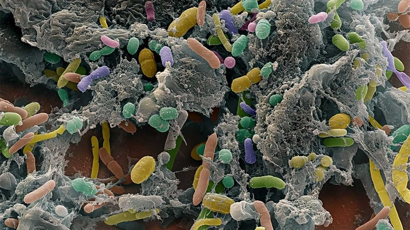

import PostOptIn from 'components/Subscribe/PostOptin'

La flora intestinal (microbiota) es el conjunto de microorganismos o bacterias que viven normalmente en nuestro intestino y es muy diversa; un adulto joven posee más de 1.000 especies bacterianas diferentes y se cree que existen otras tantas aún desconocidas que influyen de alguna manera en la salud del huésped. 

Es un hecho que cada individuo posee una composición de flora intestinal distinta, esto se debe a la influencia de varios factores sobre la composición de la microbiota. El tipo de parto y la lactancia materna juegan un rol importante en la modulación de la microbiota en el humano.

Posteriormente, se ve influenciada por la carga genética y factores ambientales como la dieta y el uso de antibióticos. Es importante comprender que la flora intestinal no es estática, sino que, puede cambiar con el paso de los años según la influencia del ambiente.

Son múltiples las funciones de la flora intestinal, la fermentación de carbohidratos sin digerir (como la fibra y almidón resistente), la absorción de minerales, la modulación de los movimientos intestinales, producción de ácidos grasos de cadena corta, los cuales estimulan el crecimiento y desarrollo de las células del intestino y colon, y la modulación de la respuesta inmunológica. Dentro de esta última, la flora intestinal actúa como una barrera que impide la multiplicación de agentes patógenos o dañinos y el desarrollo de enfermedades gastrointestinales.

Últimamente, se ha estudiado la estrecha relación entre la microbiota, la carga genética, el medio ambiente y el sistema inmunológico. En este sentido, investigaciones recientes han propuesto a la flora intestinal como un factor que puede influir en la aparición de la obesidad y la diabetes en el huésped.

## Obesidad y flora intestinal

Se cree que la microbiota intestinal podría cambiar el balance energético, trayendo consigo cambios metabólicos y a nivel del cerebro que favorecerían al desarrollo de obesidad. Adicionalmente, los científicos han postulado que dependiendo las especies bacterianas que conformen microbiota, ésta podría contribuir a una acumulación de grasa corporal. Algunos estudios realizados en animales de laboratorio han identificado algunas especies de la flora intestinal que están asociadas al desarrollo de obesidad. 

Otro mecanismo por lo cual las bacterias de la flora intestinal pueden influir en el aumento de peso corporal, es mediante la capacidad que tienen algunas especies como Firmicutes de digerir algunos carbohidratos indigeribles por las enzimas del humano, dando lugar a moléculas de carbohidratos más pequeñas y ácidos grasos de cadena corta capaces de ser absorbidos por el huésped, obteniendo así más energía de sustancias que en el sujeto delgado se eliminarían por las heces sin ser absorbidas.

Un resultado importante de estudios en esta área es que se ha visto que al cambiar una alimentación alta en grasas y baja en fibra por una baja en grasas y alta en fibra, pareciera generar cambios positivos en la flora intestinal desde el mismo día que la dieta es consumida. Todos estos hallazgos son de gran importancia para tenerlos en consideración en el tratamiento de la obesidad.

<PostOptIn/>

## ¿Cómo la flora intestinal puede favorecer a la diabetes?

La flora intestinal regula en cierta medida el sistema inmune, e influye en las respuestas inmunológicas localizadas o generales del organismo; por lo que se cree, que mediante un proceso inmunológico podría influir en la inflamación crónica asociada a la obesidad y resistencia insulínica. 

Según algunos estudios son varios los mecanismos que relacionan la flora intestinal y el desarrollo de [resistencia a la insulina y diabetes](/resistencia-la-insulina-y-diabetes-es-lo-mismo/), entre ellos resaltan los cambios en la permeabilidad intestinal, endotoxemia (manifestaciones clínicas asociadas por una exagerada reacción inflamatoria), interrelación con ácidos biliares, cambios en la proporción de tejido adiposo marrón y efectos asociados al uso de fármacos como la metformina.

Los mecanismos más estudiados se presentan a continuación:

### - Incremento en la endotoxemia
La diabetes, especialmente la tipo 2, se asocia a un estado proinflamatorio, que dificulta la unión de la insulina a su receptor, favoreciendo la aparición de la resistencia a la insulina y la diabetes. El sobrepeso y la obesidad parece ser el punto de partida para iniciar el proceso inflamatorio. Al parecer la flora intestinal tiene la capacidad de generar cambios en la inflamación del tejido adiposo. 

Algunos estudios han demostrado que ciertos compuestos llamados lipopolisacáridos, los cuales son un componente de la pared celular de algunos tipos de bacterias, se absorben por las células del colon y son transportados a la sangre aumentando sus niveles y produciendo aumento en la inflamación característica en el síndrome metabólico, este hecho se ve favorecido por dietas ricas en grasas. De aquí, la propuesta que la endotoxemia producida por altos niveles de lipopolisacáridos, en respuesta a niveles elevados de lípidos en la dieta, podría favorecer al desarrollo de resistencia a la insulina y diabetes.

La flora intestinal de los individuos con sobrepeso y obesos es menos variada que la de los individuos normopeso. Por ello las personas con menos variedad en las especies que conforman la flora tienden a presentar mayor adiposidad, resistencia a la insulina, niveles altos de colesterol y triglicéridos y marcadores en sangre de inflamación más pronunciado comparado con aquellos con una variedad mayor.

### - Cambios en las características del tejido adiposo marrón

Es conocido que el tejido adiposo se divide en dos, el tejido adiposo marrón con actividad hormonal y control de la temperatura corporal, y el tejido adiposo blanco el cual se caracteriza por ser un tejido de reserva de grasa y energía. En la obesidad existe una reducción de la actividad del tejido adiposo marrón, el cual favorece una apariencia delgada, además de mejorar la sensibilidad a la insulina.

En respuesta al frío o ejercicio, células de grasa marrón nacen en el tejido adiposo blanco, también conocidas como células de color beige. Los resultados de algunos estudios han arrojado que la microbiota intestinal disminuye la aparición de los adipocitos beige, a través de un proceso que involucra el sistema inmune.

### - Producción de ácidos biliares

La bilis es una sustancia que ayuda a la digestión de las grasas; tras una comida, ella es liberada al intestino, gran parte de esta es nuevamente incorporada al organismo para su reutilización, otra pequeña parte llega al colón donde la flora intestinal la modifica, dando origen a los ácidos biliares secundarios, estos ácidos biliares secundarios intervienen mejorando la captación de la insulina por su receptor y regulando la glicemia. 

En individuos con sobrepeso y obesidad, pareciera haber una disminución en la producción de ácidos biliares secundarios y en consecuencia aumento en el riesgo de resistencia a la insulina y diabetes.

### - Influencia de la metformina

Estudios han demostrado que el uso de metformina en el tratamiento de la Diabetes Mellitus tipo 2, puede modificar la flora intestinal, probablemente por su relación con sus efectos gastrointestinales.

En líneas generales una mayor aproximación científica al mundo de la flora intestinal podría contribuir a conocer su potencial como tratamiento para tratar la obesidad, el síndrome metabólico y la diabetes.

## Cambios en la flora intestinal por la dieta

El consumo de probióticos y prebióticos pareciera modificar la flora intestinal y mejorar el metabolismo de carbohidratos. En algunos estudios realizados recientemente en los cuales se analizaron las respuestas de bebés que tenían alto riesgo genético de desarrollar Diabetes Mellitus tipo 1 se les administró probióticos antes de los 3 meses de edad, encontrando una disminución en el riesgo de diabetes.

El uso de probióticos también se ha asociado con la disminución de los niveles de lipopolisacáridos bacterianos en sangre, lo cual podría disminuir la endotoxemia, y, por ende, el desarrollo de obesidad y resistencia a la insulina. La ingestión de Lactobacillus casei, presente principalmente en el yogurt enriquecido con probióticos, retrasó el inicio de diabetes en experimentos con animales de laboratorio.

El consumo de vino tinto de forma moderada pareciera que también puede modular el crecimiento de la microbiota intestinal. La hipótesis es que los polifenoles del vino pueden actuar como prebióticos aumentando el número de ciertas especies de bacterias beneficiosas y conduciendo a una menor cantidad de lipopolisacáridos, en consecuencia, disminuiría la endotoxemia y el riesgo a desarrollar síndrome metabólico y diabetes.

El tratamiento con probiótico en dosis farmacológicas es otra línea que se está investigando. El mecanismo se basa en crear suplementos con cepas vivas de bacterias del tipo bifidobacterias y lactobacilos, las cuales colonizan el intestino modificando la composición de la flora intestinal; en animales de laboratorio se han realizado experimentos encontrando un efecto antidiabético y disminución de la endotoxemia, luego de la ingesta de estos suplementos.

En este orden de ideas, la oligofructosa es otro compuesto utilizado como prebiótico en las investigaciones sobre la microbiota. Algunos hallazgos encontrados es que el consumo de oligofructosa pareciera aumentar la fermentación en el colón, los productos generados de dicha fermentación podrían tener efectos la disminución de la sensación de hambre y la disminución de la glicemia luego de las comidas.

## Otras alternativas de tratamiento

Investigaciones más recientes han demostrado algo impactante, en la búsqueda de modificar la flora intestinal, se ha evaluado el trasplante de microbiota intestinal. Inicialmente este tipo de trasplante se hace en aquellos pacientes con enfermedades crónicas del intestino, reestableciendo el equilibrio de la flora intestinal.

Partiendo de esta concepción los científicos han realizado trasplantes de microbiota con el fin de tratar otras enfermedades como la obesidad, diabetes y enfermedades cardiovasculares. Entre los resultados encontrados en estos estudios destaca que luego de trasplantar la microbiota de individuos sanos a individuos con síndrome metabólico, estos últimos mejoraron la captación de la insulina por parte del receptor, disminuyendo así la resistencia a la insulina.
